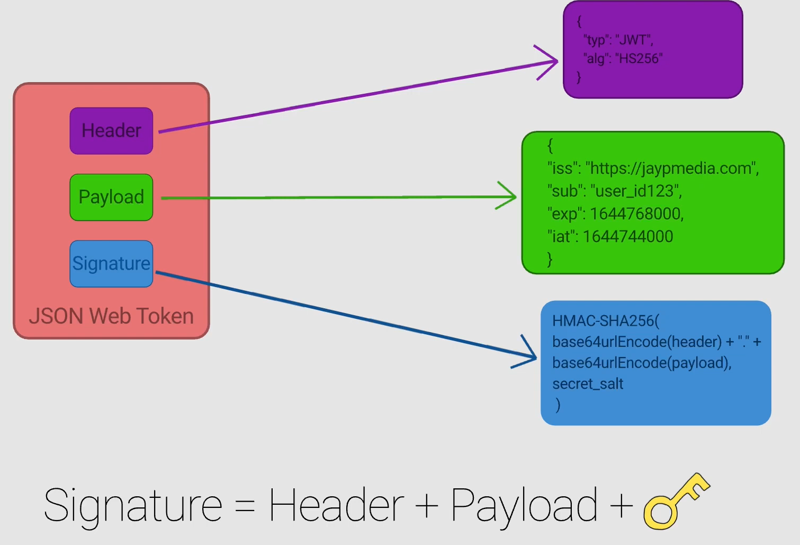
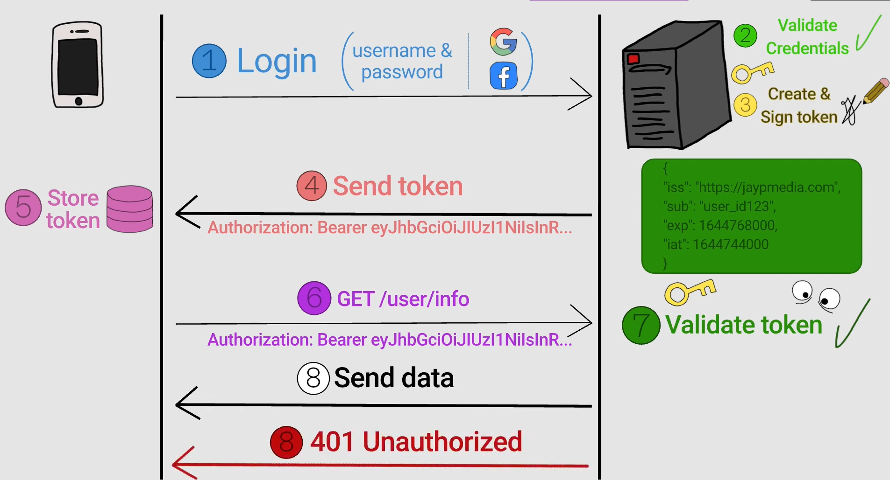

# JWT

# Authentication

Client gets "401 Unauthorized" if:

* Client creates JWT using wrong secret key
* Client modifies JWT and Server doesn't validate JWT after uses its own secret key on server side
* JWT is expired

"401 Unauthorized" status code indicates that the request lacks valid authentication credentials. 

# Authorization

Client gets "403 Forbidden" if:

* Client tries to access a resource (endpoint for example in a API) and it doesn't have the permission (example, use doesn't have role: Admin), 

"403 Forbidden" status code signifies that the server understands the request but refuses to fulfill it.

## API Authorize validations

Endpoint:

* No [Authorize]: No Authentication
* [Authorize]: There is Authentication
* [Authorize(Roles = "Admin")]: There is Authentication and Admin Role Authorization

# JWT JSON

signature is used to validate if the JWT is valid



# Flow

* Client sends user credentials and server sends back JWT to client if user is authenticated
* Client sends request to server with JWT for a protected resource/endpoint and JWT returns response or 401/403 status code



# Refresh tokens 

Instead of providing the user with an access token that has a long expiration time, issue a short-lived access token along with a refresh token

Reason of using Refresh token: 
* Validating a signed token is less costly, but revoking is difficult. By having the access tokens be short lived, JWT easily expires rather than revoked explicitly.
* Access tokens are exchanged with (potentially many) resource servers, which increases the chance of leakage. Refresh tokens are only ever exchanged with the authorization server. Again, the short-livedness of access tokens is at least some level of mitigation.

```
  +--------+                                           +---------------+
  |        |--(A)------- Authorization Grant --------->|               |
  |        |                                           |               |
  |        |<-(B)----------- Access Token -------------|               |
  |        |               & Refresh Token             |               |
  |        |                                           |               |
  |        |                            +----------+   |               |
  |        |--(C)---- Access Token ---->|          |   |               |
  |        |                            |          |   |               |
  |        |<-(D)- Protected Resource --| Resource |   | Authorization |
  | Client |                            |  Server  |   |     Server    |
  |        |--(E)--- Expired Token ---->|          |   |               |
  |        |                            |          |   |               |
  |        |<-(F)- Invalid Token Error -|          |   |               |
  |        |                            +----------+   |               |
  |        |                                           |               |
  |        |--(G)----------- Refresh Token ----------->|               |
  |        |                                           |               |
  |        |<-(H)----------- New Access Token ---------|               |
  +--------+									       +---------------+
  ```